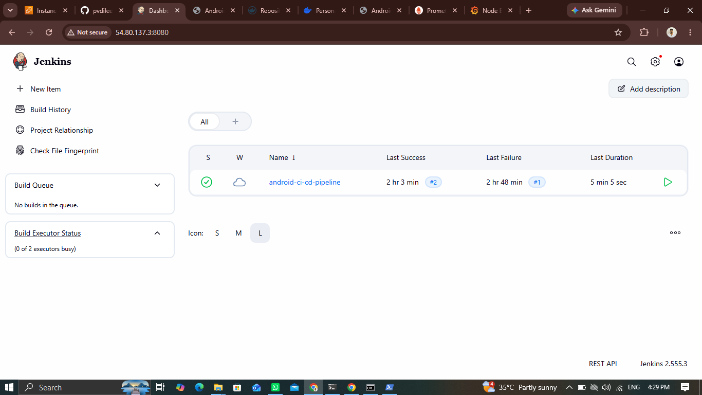
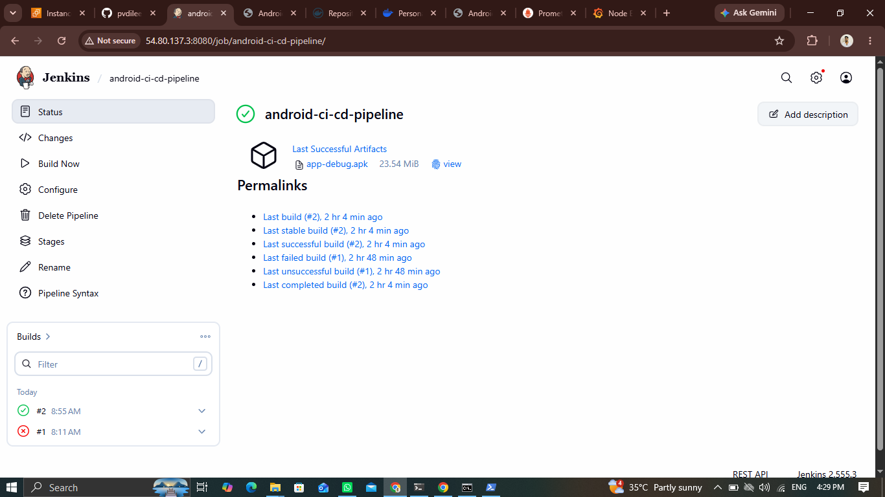
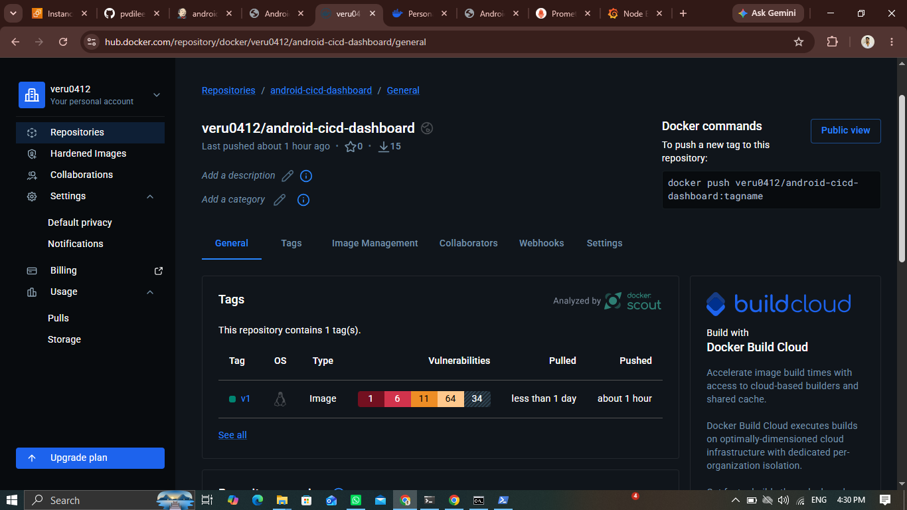
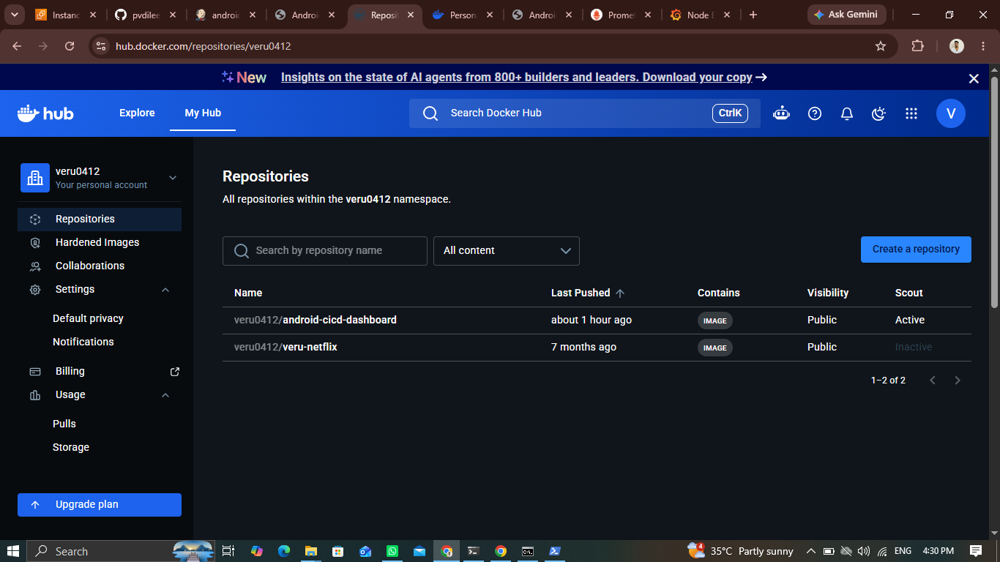
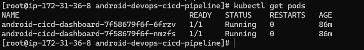
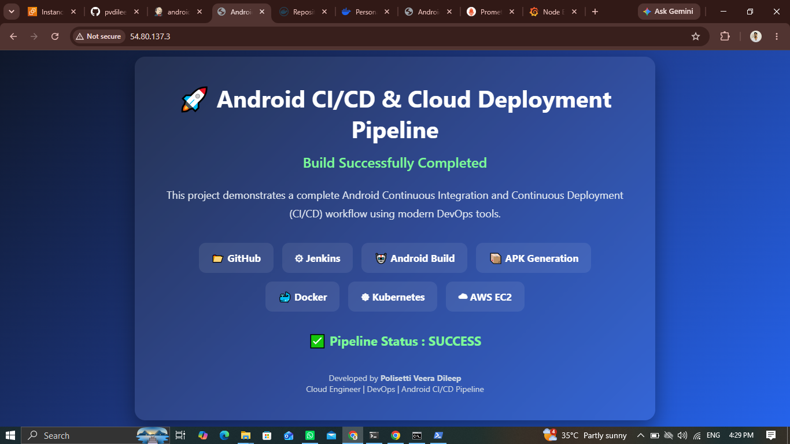
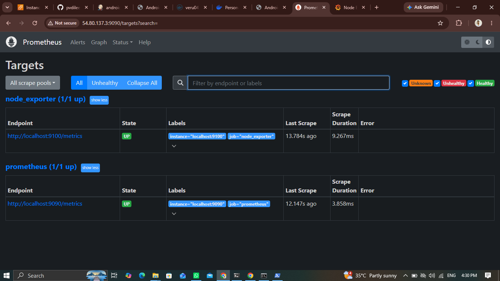
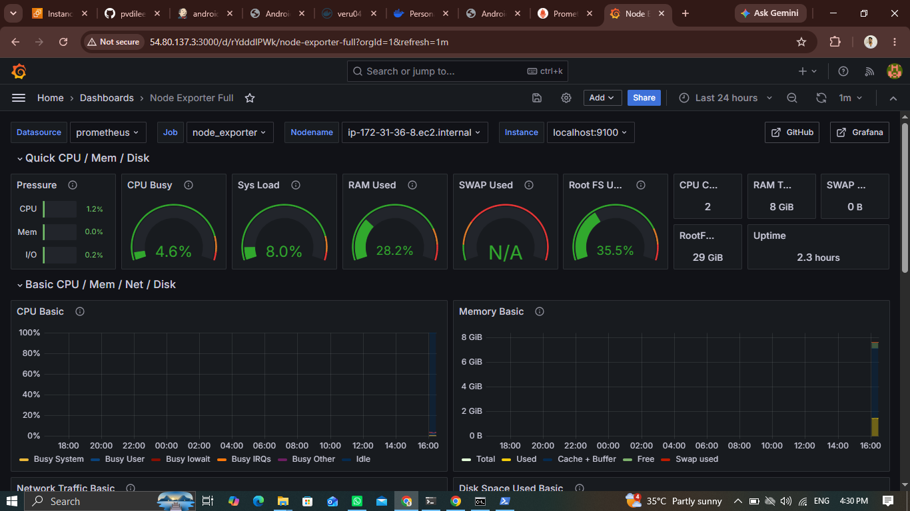
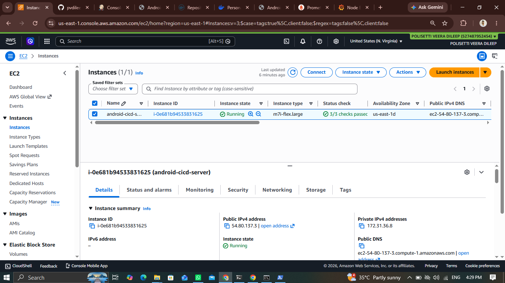

# 🚀 Android DevOps CI/CD Pipeline

A complete Android DevOps CI/CD Pipeline demonstrating Continuous Integration and Continuous Deployment using GitHub, Jenkins, Docker, Kubernetes, Prometheus, Grafana and AWS EC2.

---

## 📌 Project Overview

This project automates the Android application build and deployment process.

The complete workflow includes:

- Source Code Management using GitHub
- Jenkins Pipeline Automation
- Android APK Build using Gradle
- Docker Image Creation
- Docker Hub Image Push
- Kubernetes Deployment
- Monitoring with Prometheus
- Visualization using Grafana
- Hosting on AWS EC2

---

## 🏗 Architecture

GitHub
↓

Jenkins CI Pipeline
↓

Android APK Build (Gradle)
↓

Docker Image Build
↓

Push Image to Docker Hub
↓

Kubernetes Deployment
↓

AWS EC2 Cluster
↓

Prometheus Monitoring
↓

Grafana Dashboard

---

## 🛠 Tech Stack

- Android
- Kotlin
- Gradle
- Git
- GitHub
- Jenkins
- Docker
- Docker Hub
- Kubernetes
- Prometheus
- Grafana
- AWS EC2
- Linux

---

## ⚙️ CI/CD Pipeline

✔ Source Code Checkout

✔ Gradle Build

✔ APK Generation

✔ Docker Image Build

✔ Docker Hub Push

✔ Kubernetes Deployment

✔ Monitoring Setup

✔ Dashboard Visualization

---

## 📸 Project Screenshots

### Jenkins Pipeline



### Jenkins Successful Build



### Docker Container



### Docker Hub Repository



### Kubernetes Pods



### Application Running



### Prometheus Targets



### Grafana Dashboard



### AWS EC2 Instance



---

## 📂 Project Structure

```
android-devops-cicd-pipeline
│
├── app/
├── cicd-dashboard/
├── kubernetes/
├── screenshots/
├── Dockerfile
├── Jenkinsfile
├── build.gradle.kts
├── settings.gradle.kts
└── README.md
```

---

## 🎯 Features

- Automated Android APK Build
- Docker Image Creation
- Docker Hub Integration
- Kubernetes Deployment
- Jenkins CI/CD
- AWS Deployment
- Prometheus Monitoring
- Grafana Dashboard

---

## 👨‍💻 Developed By

**Polisetti Veera Dileep**

Cloud Engineer | DevOps Engineer

GitHub:
https://github.com/pvdileep
